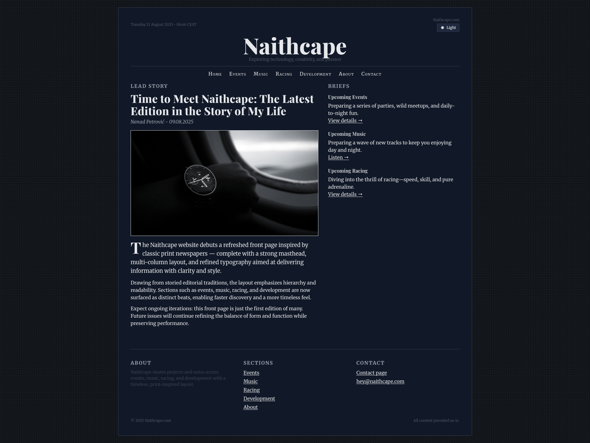
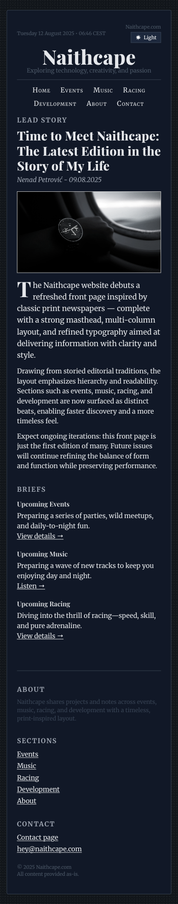
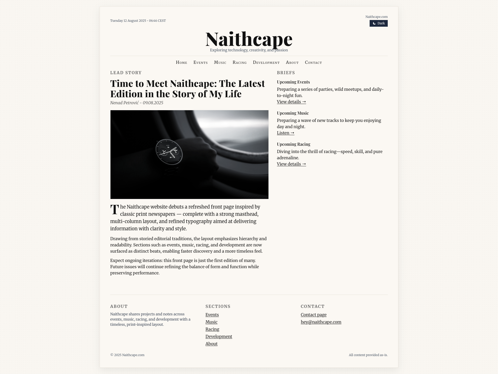
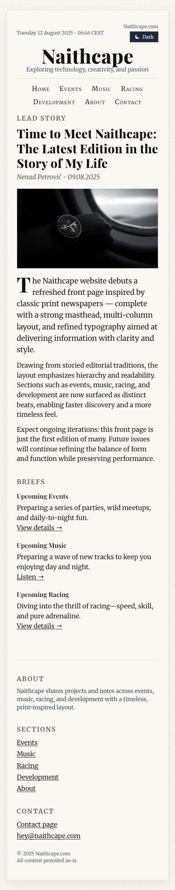

# Newspaper Portfolio Website

A modern, responsive newspaper-style portfolio website built with Kiru CSR (Client-Side Rendering). This project showcases various content categories in a newspaper layout format.

## 📋 Features

- **Multi-page Layout**: Navigate through different sections seamlessly with client-side routing
- **Responsive Design**: Optimized for various screen sizes and devices
- **Content Categories**: Dedicated sections for Events, Music, Racing, Development, and more
- **Fast Performance**: Built with Kiru and Vite for optimal loading speeds
- **Modern UI**: Clean, newspaper-inspired design

## 🖼️ Screenshots

### Desktop


### Mobile


### Desktop


### Mobile


## 🚀 Getting Started

### Prerequisites

- Node.js (v16 or higher)
- npm or yarn

### Installation

1. Clone the repository
   ```bash
   git clone https://github.com/yourusername/newspaper-portfolio-website.git
   cd newspaper-portfolio-website
   ```

2. Install dependencies
   ```bash
   npm install
   # or
   yarn
   ```

3. Start the development server
   ```bash
   npm run dev
   # or
   yarn dev
   ```

4. Open your browser and navigate to `http://localhost:5173`

### Building for Production

```bash
npm run build
# or
yarn build
```

To preview the production build:
```bash
npm run preview
# or
yarn preview
```

## 📚 Content Sections

The website includes the following main sections:

- **Home**: Main landing page with featured content
- **Events**: Calendar and information about upcoming events
- **Music**: Music-related content and reviews
- **Racing**: Racing news and updates
- **Development**: Software development articles and resources
- **About**: Information about the website and its creator
- **Contact**: Contact form and information

Additional content categories:
- Advice
- Learning resources
- Books
- Travel guides
- General resources

## 🛠️ Technologies Used

- [Kiru](https://kirujs.dev) - A modern JavaScript framework
- [Vite](https://vitejs.dev/) - Next generation frontend tooling
- [TypeScript](https://www.typescriptlang.org/) - Typed JavaScript
- [TailwindCSS](https://tailwindcss.com/) - Utility-first CSS framework

## 📄 License

This project is licensed under the MIT License - see the LICENSE file for details.

## 🙏 Acknowledgements

- [Kiru Documentation](https://kirujs.dev) for the excellent framework and resources
- All contributors and maintainers

---

Visit [https://kirujs.dev](https://kirujs.dev) for more information about the Kiru framework.